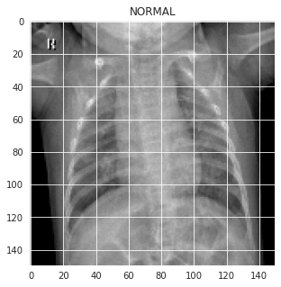
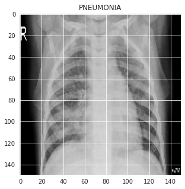
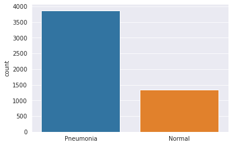

# Pneumonia Detection using CNN based classification 

Pneumonia Detection using CNN based classification model trained on chest x-ray scans of normal and people diagnosed with pneumonia. We trained a Convolutional Neural Network designed to process these x-ray images of the chest with pre-classified labels from the training set to replicate those results on the test set.

## Data Visualization & Preprocessing

We trained on a dataset of:

- over 5216 total x-ray images
- 1341 x-ray images of normal class
- 3875 x-ray images of pneumonia class
- highly imbalanced

We tested on a dataset of:

- over 624 total x-ray images
- 234 x-ray images of normal class
- 390 x-ray images of pneumonia class

For more info on the data: https://data.mendeley.com/datasets/rscbjbr9sj/2

License: https://creativecommons.org/licenses/by/4.0/

Images from both the classes

Visualizing the data

As you can clearly see the data is imbalanced. Training a model on this imbalanced data would result in naive behaviour where the model would be always favoring the pneumonia class and still produce a decent accuracy but such results would be useless. To avoid this overfitting, we will increase the number of training examples using data augmentation.

## Model details

|Layer (type)                 |   Output Shape      |  Param    |  
|-----------------------------|---------------------|-----------|
|conv2d-5 (Conv2D)            | (150, 150, 32)      | 320       | 
|max-pooling2d-5 (MaxPooling2 | (75, 75, 32)        | 0         |  
|conv2d-6 (Conv2D)            | (75, 75, 64)        | 18496     |
|max-pooling2d-6 (MaxPooling2 | (38, 38, 64)        | 0         |
|conv2d-7 (Conv2D)            | (38, 38, 128)       | 73856     |
|max-pooling2d-7 (MaxPooling2 | (19, 19, 128)       | 0         |
|conv2d-8 (Conv2D)            | (19, 19, 128)       | 147584    |
|max-pooling2d-8 (MaxPooling2 | (10, 10, 128)       | 0         |
|flatten-1 (Flatten)          | (12800)             | 0         |
|dropout-4 (Dropout)          | (12800)             | 0         |
|dense-2 (Dense)              | (512)               | 6554112   |
|dense-3 (Dense)              | (1)                 | 513       |

Total params: 6,794,881

Trainable params: 6,794,881 

Non-trainable params: 0 

_________________________________________________________________

#### Inputs and output

- The **input** is a batch of images and each image has a shape (150,150,1).
- The **output** represents a binary classification of the input images as 1 (Pneumonia) or 0 (Normal).

## Results

On the test set, we achieved:

- Accuracy  = 0.92
- F1-score  = 0.92
- Recall    = 0.93
- Precision = 0.91 

# Model type conversion

The model was converted into a TFLite model using the TFLiteConverter for deploying it to android Apps.

## Stay Healthy App

The app uses the generated tflite model for image classification. 
User Uploads the chest X-ray of the person.
The image is first converted into a bitmap and then each pixel is extracted and stored into a ByteBuffer.
An Interpreter object is instantiated which holds the tflite model.
This interpreter object is then invoked by passing 2 ByteBuffer objects (the input and the output), the output is modified during this call.

## App Permissions
- READ EXTERNAL STORAGE
